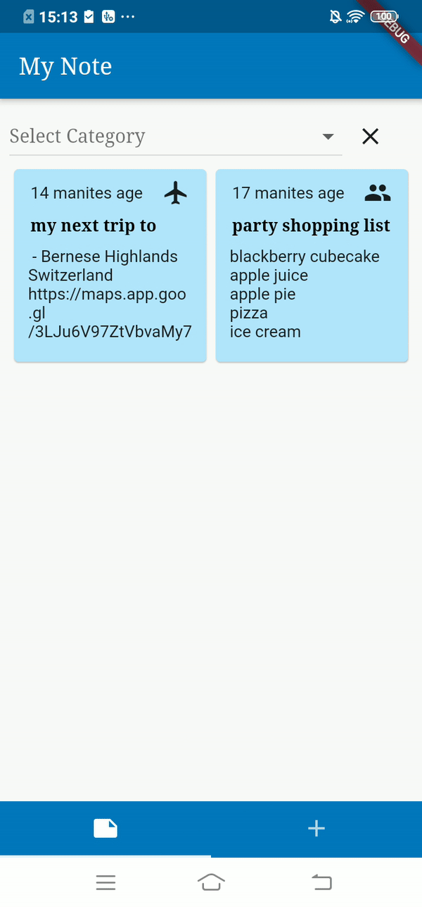
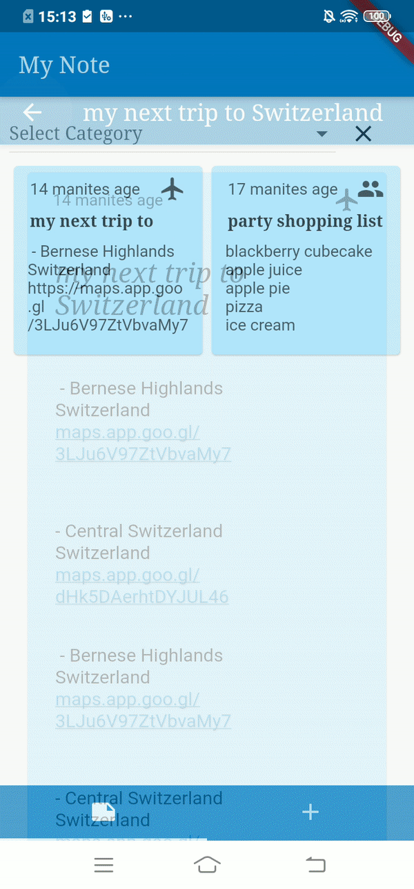

# Notes App

Notes App is a [Flutter](https://flutter.dev/) application that build for Flutter Challenge. The chanllenge mede by [mais alheraki.](https://github.com/pr-Mais)

# App functions
 - Creating a new note.
 - Editing existing notes.
 - Deleting existing notes.

## Libaray
The libaray the has been used to develop this app.

| Libaray | Link |
| ------ | ------ |
| sqflite | https://pub.dev/packages/sqflite |
| path_provider | https://pub.dev/packages/path_provider |
| flutter_linkify | https://pub.dev/packages/flutter_linkify |
| url_launcher | https://pub.dev/packages/url_launcher |
| shared_preferences | https://pub.dev/packages/shared_preferences |
| image_picker | https://pub.dev/packages/image_picker |

License
---

MIT

## Some Screenshots

  

